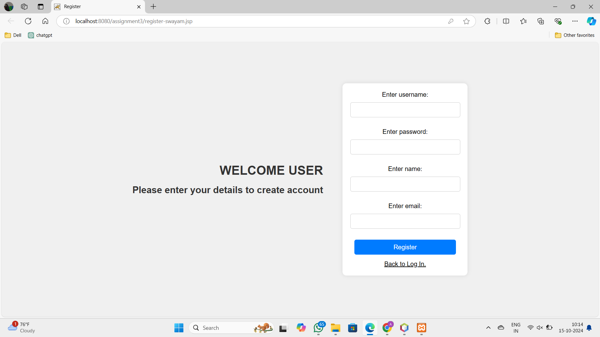

# Online Bookstore (Java EE)

An Online Bookstore web application built using JSP and Servlet technology that provides users with the ability to browse, search, and purchase books with ease. This project simulates the real-world functionality of an online bookstore, making it ideal for practicing Java EE web technologies.

## Features

- **User Registration & Login**: Users can create an account and log in securely.
  
  

- **Book Search**: Search for books by title, author, genre, ISBN, or price range. Results are dynamically displayed and updated.
  
  

- **Book Details**: Each book has its own dedicated page displaying detailed information like price, author, and summary.
  
  

- **Shopping Cart**: Users can add books to a shopping cart, adjust quantities, and remove items before proceeding to checkout.
  
  

- **Order Management**: Generate an itemized bill and order summary for the selected purchases.
  
  

- **Session Management**: User sessions are maintained throughout the browsing experience, allowing users to continue their session as long as they're logged in.

## Tech Stack

- Java EE (JSP, Servlets)
- MySQL for database management
- Apache Tomcat as the server
- HTML, CSS, JavaScript for the frontend

## Deployment

The application is containerized using Docker for easier deployment and scalability.

## Installation Instructions

1. Clone the repository:
   ```bash
   git clone https://github.com/your-username/Online-Bookstore-Java-EE.git
