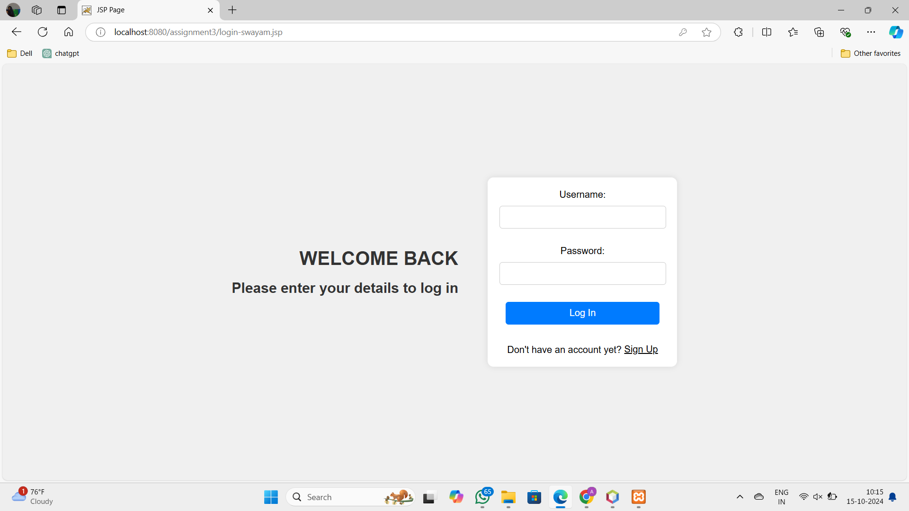
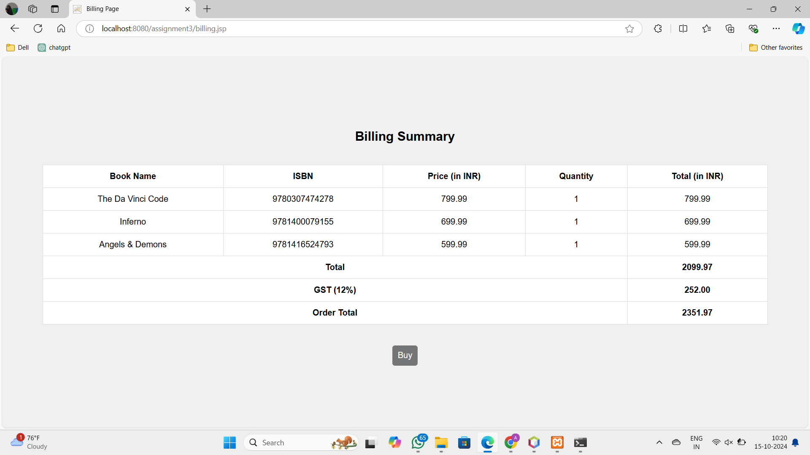
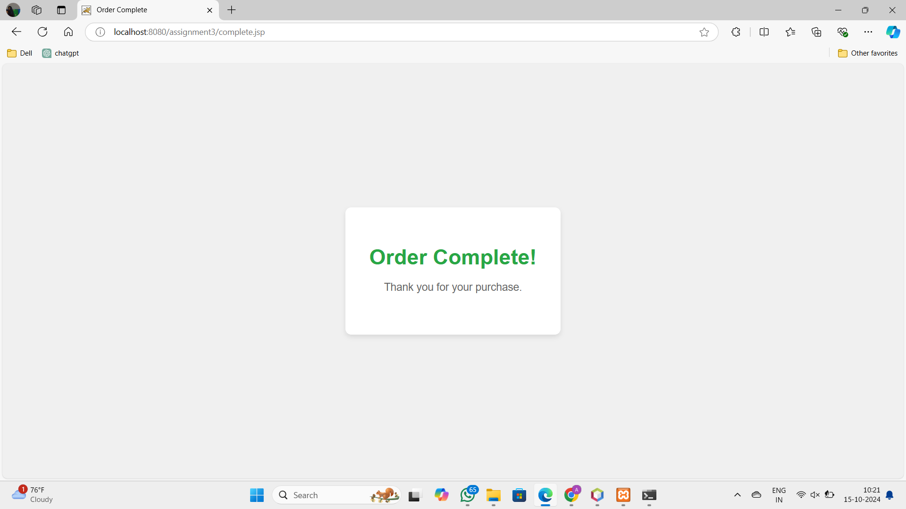

# Online Bookstore (Java EE)

An Online Bookstore web application built using JSP and Servlet technology that provides users with the ability to browse, search, and purchase books with ease. This project simulates the real-world functionality of an online bookstore, making it ideal for practicing Java EE web technologies.

## Features

- **User Registration & Login**: Users can create an account and log in securely.
<div style="display: flex; justify-content: space-around;">
    
    
</div>

- **Book Search**: Search for books by title, author or ISBN. Results are dynamically displayed and updated.
    

- **Book Results**: Search results will be displayed along with a checkbox (to select specific books to be added in cart) and counter (to specify the number of selected books).
    

- **Billing**: Generate an itemized bill and order summary for the selected purchases.
    

- **Complete**: End message displayed on the screen to indicate the completion of a purchase.
    

## Tech Stack

- Java EE (JSP, Servlets)
- MySQL for database management
- Apache Tomcat as the server
- HTML, CSS, JavaScript for the frontend


## Installation Instructions

1. Clone the repository:
   ```bash
   git clone https://github.com/your-username/Online-Bookstore-Java-EE.git
